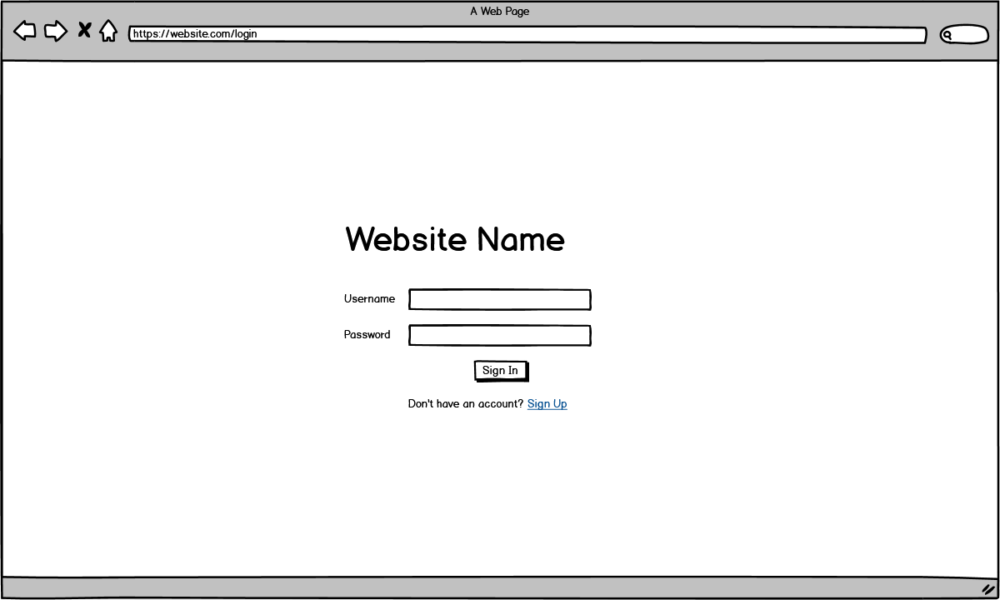
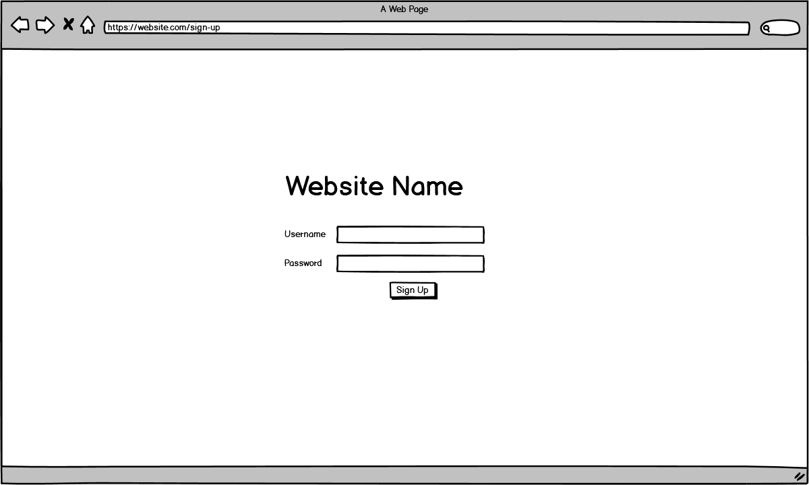
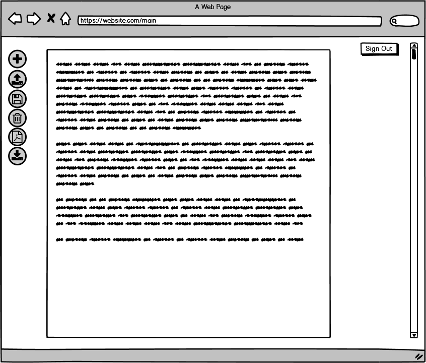

# All In One Markdown

<https://trello.com/b/xCCDsnrL/allinonemd>

## Purpose

To allow the upload, storage, editing, downloading and converting to pdf (with images) in one location to limit the need to use third party software when writing documentation in markdown files. When using third party websites to convert Markdown (MD) to pdf format it is inconveniant how few support the use of images and it can get messy with storage on a users device. This solution's pupose is to accumulate the diffrent aspects of documentaion into *one* conveiniant and easy to use method for a user.

## Wireframes

