# All In One MD

[Git Repo](https://github.com/Magni0/AllInOneMD)

[Website](https://allinonemd.ml/)

The purpose of this web application is to centralize the process of documentation with markdown files and to act as temporary cloud storage for such documentation as well. The web app must be able to:

1. create, edit and save markdown files to the cloud.
2. have a user register and login to only show and edit the documents of that user.
3. have a markdown file converted to pdf format and downloaded to the client.

The primary audience of this web app are students of a field in IT and people in the IT industry more specifically those in project management or documentation roles and in some cases programmers as well. The web application's tech stack is comprised of:

- Python3
- HTML/CSS
- PostgreSQL
- NGINX
- Gunicorn

## DataFlow Diagram

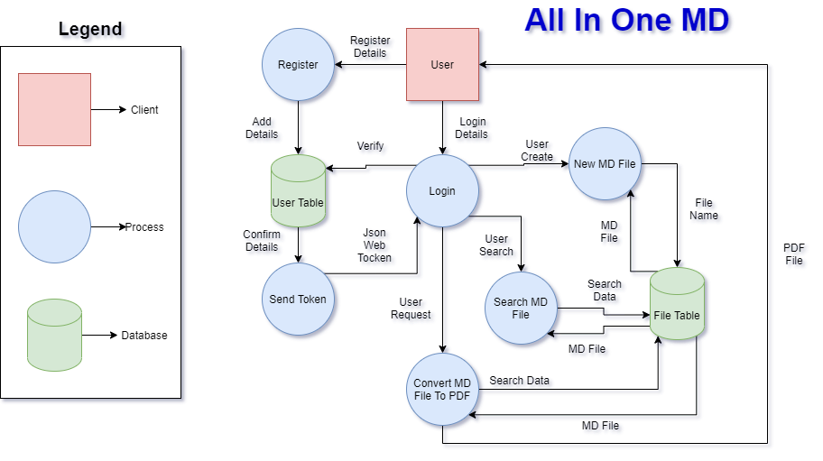

## Application Architecture Diagram

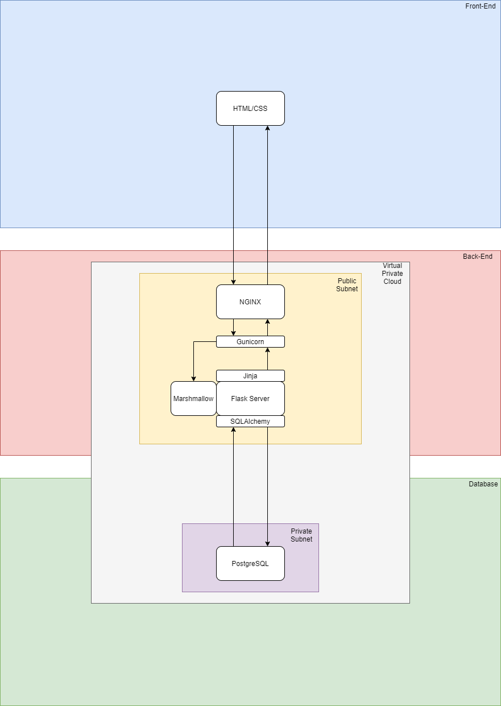

## User Stories

As a computer science student I want to store my documentation remotely so I can retrieve it whenever or wherever I want to.

As a software engineer I want to make edits to my technical documentation as I change the software.

## Wireframes

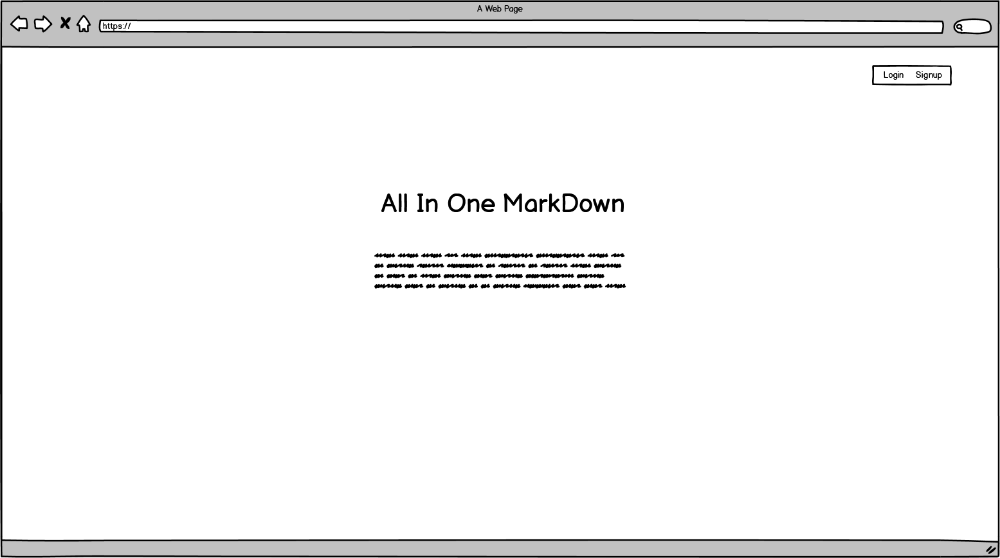
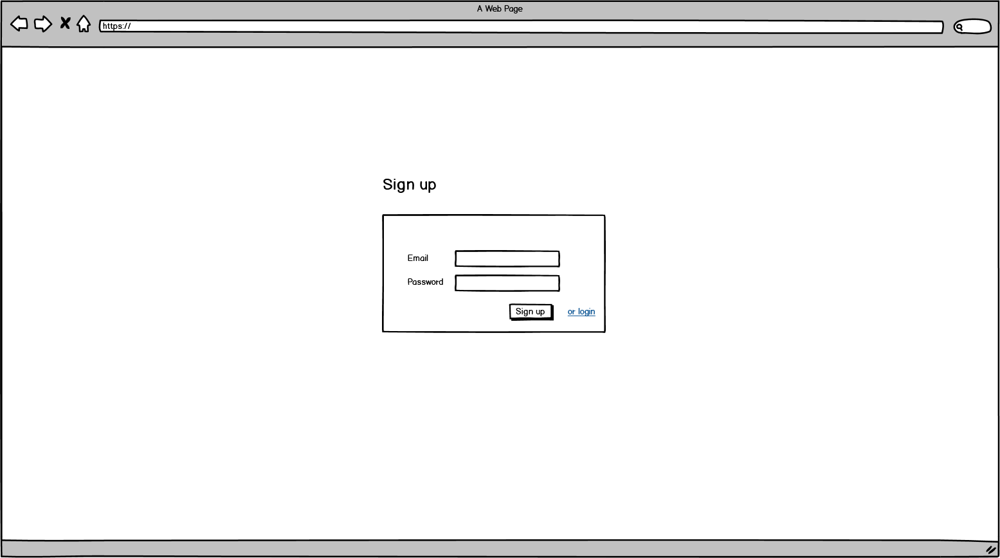

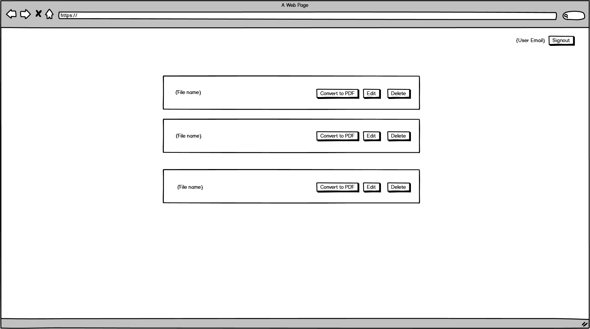
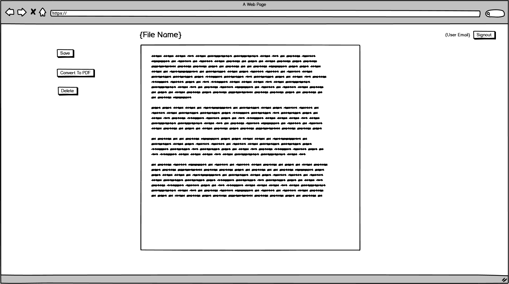

## Planning Process Project Management

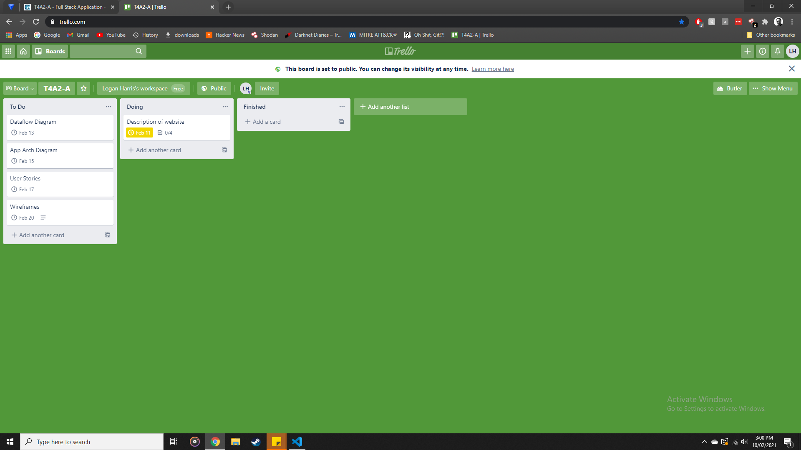
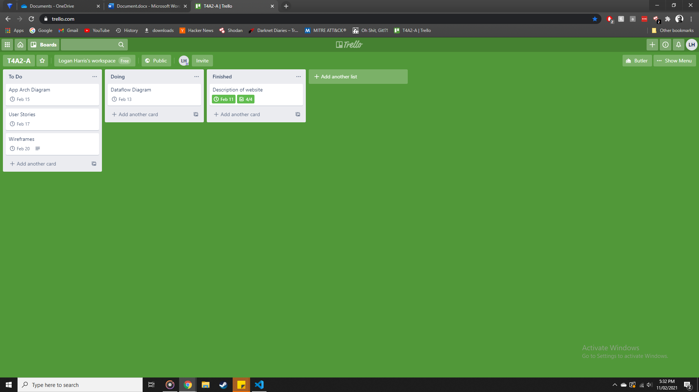
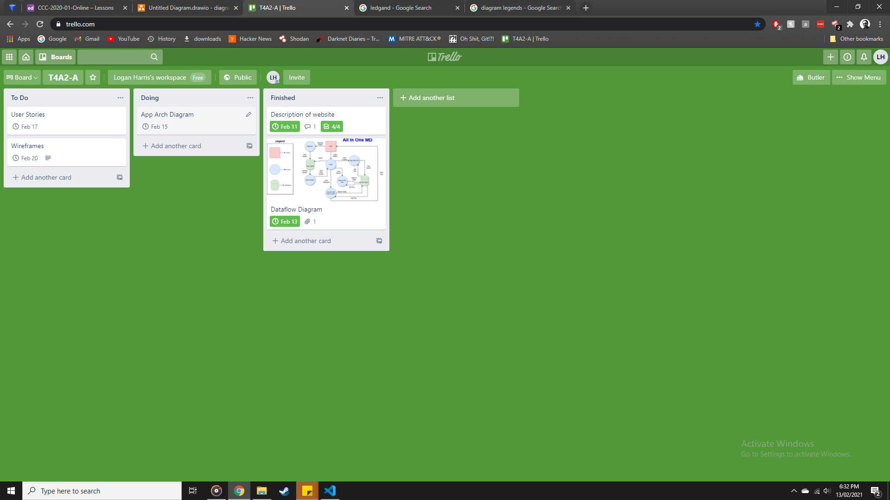
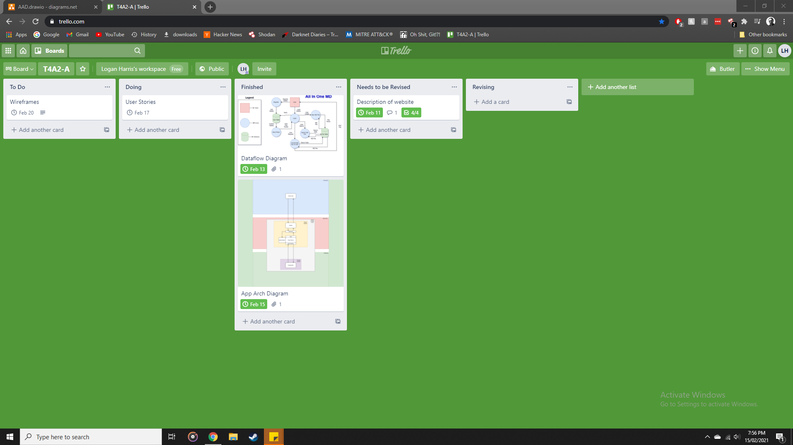
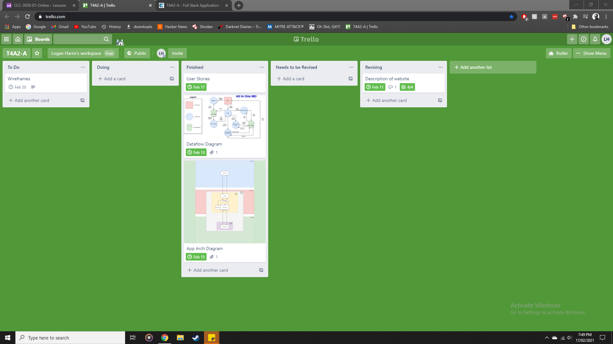
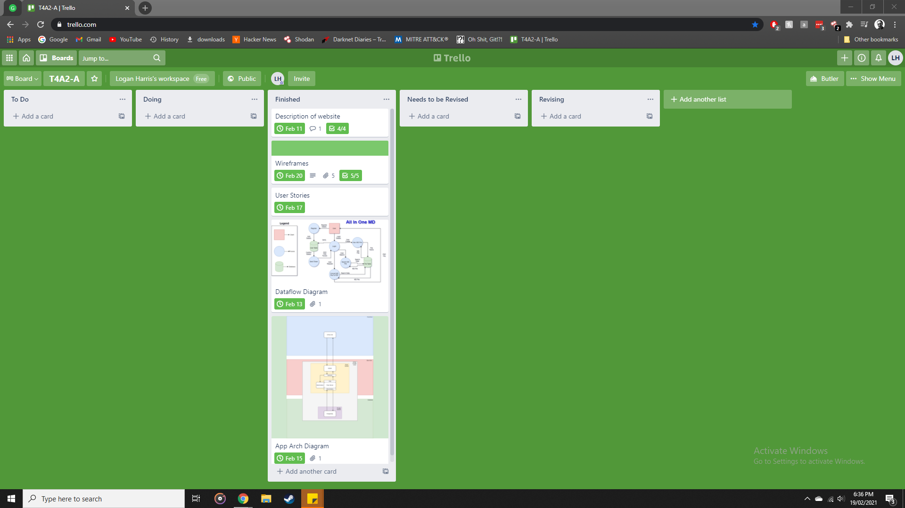